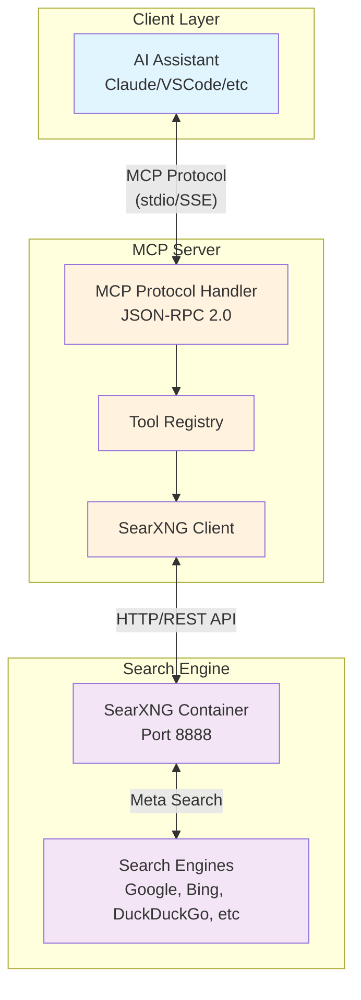
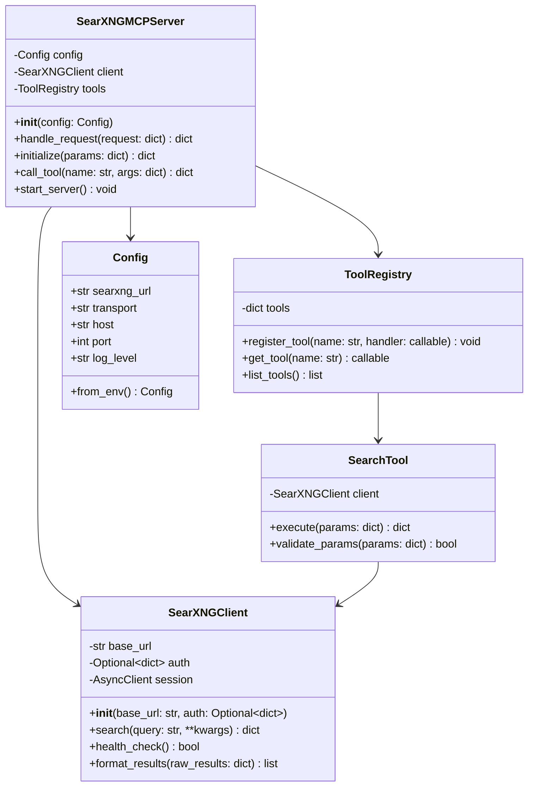
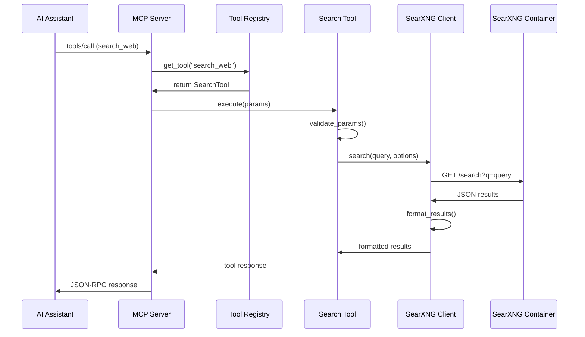
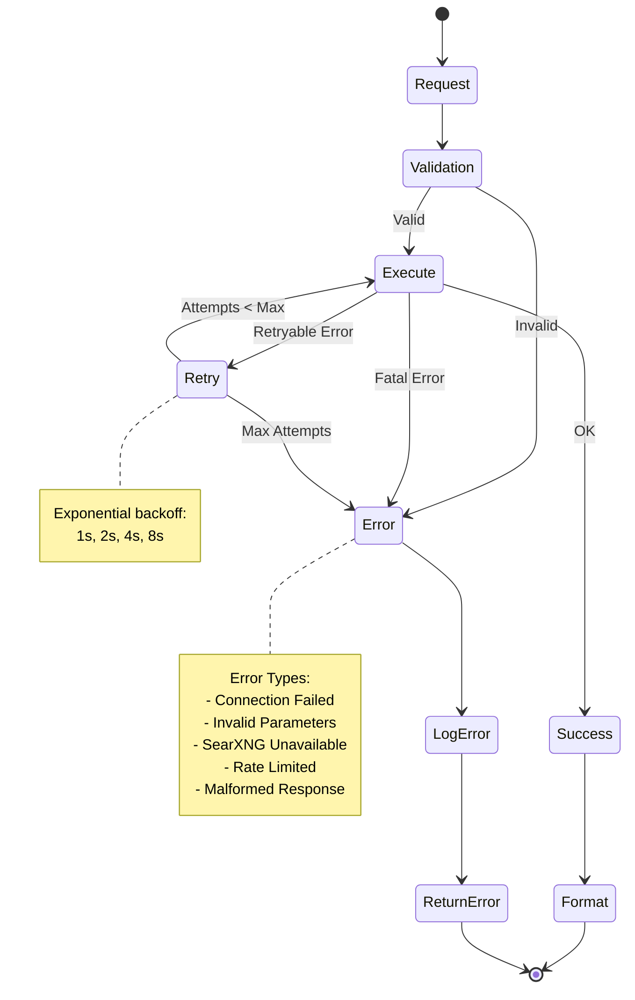
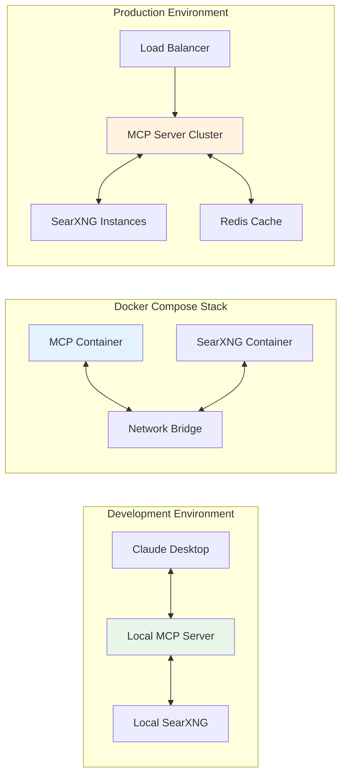
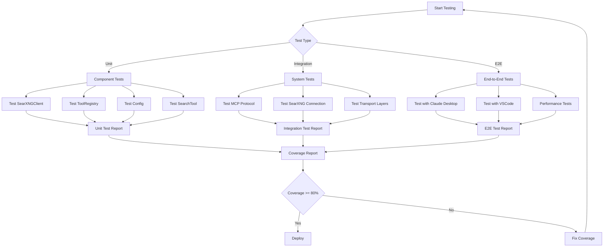
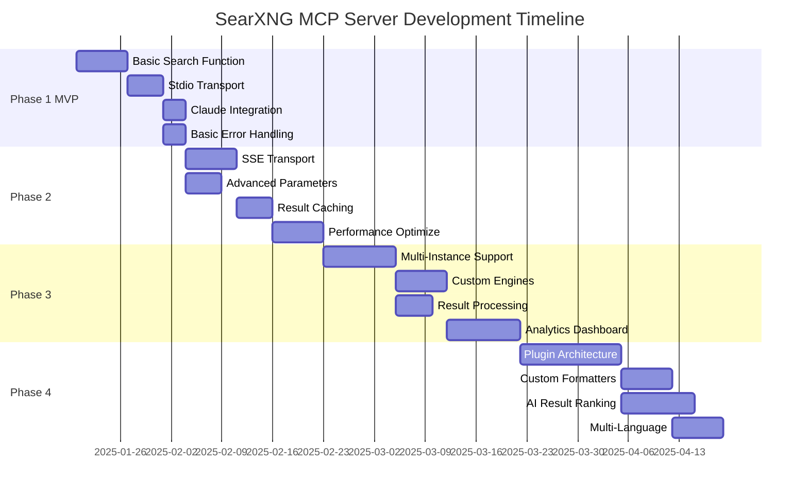

# SearXNG MCP Server Design Document

## Executive Summary

This document outlines the design and architecture for a Model Context Protocol (MCP) server that integrates with a SearXNG search container. The server will provide privacy-respecting search capabilities to AI assistants and LLM applications through a standardized protocol.

## System Overview

### Purpose
Create an MCP server that:
- Connects to an existing SearXNG container instance
- Exposes search functionality through the MCP protocol
- Enables AI assistants to perform web searches while preserving privacy
- Supports both stdio and SSE transport protocols

### Key Components
1. **MCP Server**: Core server implementation handling protocol communication
2. **SearXNG Client**: API client for interacting with SearXNG container
3. **Search Tools**: Exposed tools for AI assistant consumption
4. **Configuration Layer**: Environment-based configuration management

## Architecture

### System Architecture Diagram



### Component Details

#### 1. MCP Server Core
- **Protocol**: JSON-RPC 2.0 over stdio or SSE
- **Language**: Python 3.9+
- **Responsibilities**:
  - Handle MCP protocol communication
  - Manage client connections
  - Route requests to appropriate handlers
  - Implement capability negotiation

#### 2. SearXNG Client Module
- **Purpose**: Abstract SearXNG API interactions
- **Features**:
  - Connection management
  - Request formatting
  - Response parsing
  - Error handling and retries
  - Authentication support (if required)

#### 3. Search Tool Implementation
- **Tool Name**: `search_web`
- **Parameters**:
  - `query` (string, required): Search query
  - `category` (string, optional): web, images, news, videos, files
  - `language` (string, optional): Language code (e.g., en, es, fr)
  - `time_range` (string, optional): day, month, year, all
  - `limit` (integer, optional): Number of results (default: 10)
  - `engines` (array, optional): Specific search engines to use

## API Specifications

### MCP Protocol Methods

#### Initialize Connection
```json
{
  "jsonrpc": "2.0",
  "method": "initialize",
  "params": {
    "protocolVersion": "0.1.0",
    "capabilities": {
      "tools": {}
    }
  }
}
```

#### Search Tool Invocation
```json
{
  "jsonrpc": "2.0",
  "method": "tools/call",
  "params": {
    "name": "search_web",
    "arguments": {
      "query": "example search",
      "category": "web",
      "limit": 10
    }
  }
}
```

### SearXNG API Integration

#### Search Endpoint
- **URL**: `{SEARXNG_BASE_URL}/search`
- **Method**: GET or POST
- **Parameters**:
  ```
  q: search query
  categories: comma-separated categories
  engines: comma-separated engines
  language: language code
  time_range: time filter
  format: json
  ```

#### Response Format
```json
{
  "results": [
    {
      "url": "https://example.com",
      "title": "Result Title",
      "content": "Result description...",
      "engine": "google",
      "score": 0.95
    }
  ],
  "number_of_results": 100,
  "query": "search query"
}
```

## Implementation Details

### Project Structure
```
searxng-mcp-server/
├── src/
│   ├── __init__.py
│   ├── server.py           # Main MCP server
│   ├── searxng_client.py   # SearXNG API client
│   ├── tools.py            # Tool definitions
│   ├── config.py           # Configuration management
│   └── utils.py            # Utility functions
├── tests/
│   ├── test_server.py
│   ├── test_client.py
│   └── test_tools.py
├── .env.example
├── requirements.txt
├── pyproject.toml
├── package.json            # MCP configuration
├── Dockerfile              # Optional containerization
└── README.md
```

### Core Classes and Functions

#### Class Diagram



#### Sequence Diagram for Search Request



### Error Handling Strategy



1. **Connection Errors**: Retry with exponential backoff
2. **Invalid Parameters**: Return descriptive error messages
3. **SearXNG Unavailable**: Cache last known good configuration
4. **Rate Limiting**: Implement request throttling
5. **Malformed Responses**: Graceful degradation with partial results

## Configuration

### Environment Variables
```env
# Required
SEARXNG_BASE_URL=http://localhost:8888

# Optional
SEARXNG_AUTH_USER=username
SEARXNG_AUTH_PASS=password
MCP_TRANSPORT=stdio  # or sse
MCP_HOST=127.0.0.1
MCP_PORT=32769
LOG_LEVEL=INFO
MAX_RESULTS=50
DEFAULT_LANGUAGE=en
REQUEST_TIMEOUT=30
RETRY_ATTEMPTS=3
```

### Claude Desktop Configuration
```json
{
  "mcpServers": {
    "searxng": {
      "command": "python",
      "args": ["/path/to/searxng-mcp-server/src/server.py"],
      "env": {
        "SEARXNG_BASE_URL": "http://localhost:8888"
      }
    }
  }
}
```

### SSE Transport Configuration
```json
{
  "mcpServers": {
    "searxng": {
      "transport": "sse",
      "url": "http://localhost:32769/sse",
      "env": {
        "SEARXNG_BASE_URL": "http://localhost:8888"
      }
    }
  }
}
```

## Deployment

### Deployment Architecture



### Local Development
```bash
# Clone repository
git clone <repository-url>
cd searxng-mcp-server

# Create virtual environment
python -m venv venv
source venv/bin/activate  # On Windows: venv\Scripts\activate

# Install dependencies
pip install -r requirements.txt

# Configure environment
cp .env.example .env
# Edit .env with your SearXNG container URL

# Run server
python src/server.py
```

### Docker Deployment
```dockerfile
FROM python:3.11-slim

WORKDIR /app

COPY requirements.txt .
RUN pip install --no-cache-dir -r requirements.txt

COPY src/ ./src/

ENV PYTHONUNBUFFERED=1
ENV MCP_TRANSPORT=stdio

CMD ["python", "src/server.py"]
```

### Docker Compose Integration
```yaml
version: '3.8'

services:
  searxng:
    image: searxng/searxng:latest
    ports:
      - "8888:8080"
    volumes:
      - ./searxng:/etc/searxng

  mcp-server:
    build: .
    environment:
      - SEARXNG_BASE_URL=http://searxng:8080
      - MCP_TRANSPORT=sse
      - MCP_PORT=32769
    ports:
      - "32769:32769"
    depends_on:
      - searxng
```

## Security Considerations

### Authentication & Authorization
- Support for SearXNG instances with basic authentication
- Token-based authentication for production deployments
- Rate limiting per client connection

### Data Privacy
- No logging of search queries by default
- Optional audit logging with user consent
- Result sanitization to prevent XSS attacks
- No persistent storage of search history

### Network Security
- HTTPS support for production deployments
- Proxy support for corporate environments
- Connection encryption for SSE transport

## Testing Strategy

### Test Flow Diagram



### Unit Tests
- Test individual components in isolation
- Mock SearXNG API responses
- Validate parameter handling
- Error condition testing

### Integration Tests
- Test full request/response flow
- Verify SearXNG connectivity
- Transport protocol testing
- Performance benchmarking

### Test Coverage Goals
- Minimum 80% code coverage
- All error paths tested
- All tool parameters validated
- Transport switching tested

## Performance Considerations

### Optimization Strategies
1. **Connection Pooling**: Reuse HTTP connections to SearXNG
2. **Response Caching**: Cache frequent searches (configurable TTL)
3. **Async Operations**: Non-blocking I/O for all network calls
4. **Result Streaming**: Stream large result sets
5. **Request Batching**: Combine multiple searches when possible

### Scalability
- Horizontal scaling through multiple server instances
- Load balancing for SSE transport
- Connection limits per instance
- Resource monitoring and alerts

## Monitoring & Logging

### Metrics to Track
- Request count and latency
- Error rates by type
- SearXNG availability
- Search result quality scores
- Client connection statistics

### Logging Configuration
```python
LOGGING_CONFIG = {
    'version': 1,
    'handlers': {
        'console': {
            'class': 'logging.StreamHandler',
            'level': 'INFO',
            'formatter': 'standard'
        },
        'file': {
            'class': 'logging.handlers.RotatingFileHandler',
            'filename': 'mcp-server.log',
            'maxBytes': 10485760,  # 10MB
            'backupCount': 5
        }
    }
}
```

## Future Enhancements

### Development Roadmap



### Phase 1 (MVP)
- Basic search functionality
- Stdio transport support
- Claude Desktop integration
- Basic error handling

### Phase 2
- SSE transport support
- Advanced search parameters
- Result caching
- Performance optimizations

### Phase 3
- Multiple SearXNG instance support
- Custom search engines
- Result post-processing
- Analytics dashboard

### Phase 4
- Plugin architecture for extensions
- Custom result formatters
- AI-powered result ranking
- Multi-language support

## Appendix

### Dependencies
```txt
# Core
mcp>=0.1.0
httpx>=0.24.0
python-dotenv>=1.0.0

# Async support
asyncio>=3.4.3
aiohttp>=3.8.0

# Utils
pydantic>=2.0.0
structlog>=23.0.0

# Development
pytest>=7.0.0
pytest-asyncio>=0.21.0
pytest-cov>=4.0.0
black>=23.0.0
mypy>=1.0.0
```

### References
- [Model Context Protocol Specification](https://modelcontextprotocol.io)
- [SearXNG Documentation](https://docs.searxng.org)
- [JSON-RPC 2.0 Specification](https://www.jsonrpc.org/specification)
- [MCP Python SDK](https://github.com/modelcontextprotocol/python-sdk)

### License
MIT License - See LICENSE file for details

### Contributors
- Initial Design: [Your Name]
- Review: [Team Members]

### Version History
- v0.1.0 - Initial design document
- Date: 2025-09-17