# Research Agent Architecture Documentation

## System Architecture Overview

The Research Agent follows a microservice architecture pattern with async-first design, enabling high concurrency and efficient resource utilization.

## Architectural Patterns

### 1. Hexagonal Architecture (Ports and Adapters)

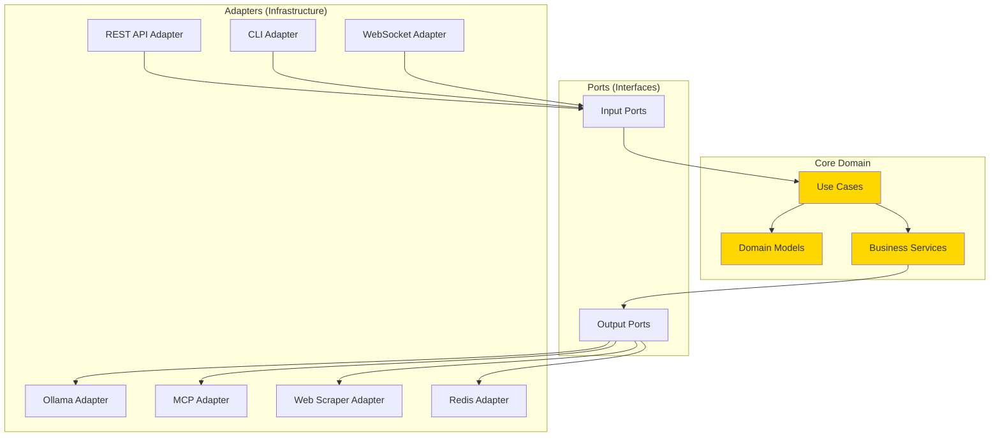

### 2. Event-Driven Architecture

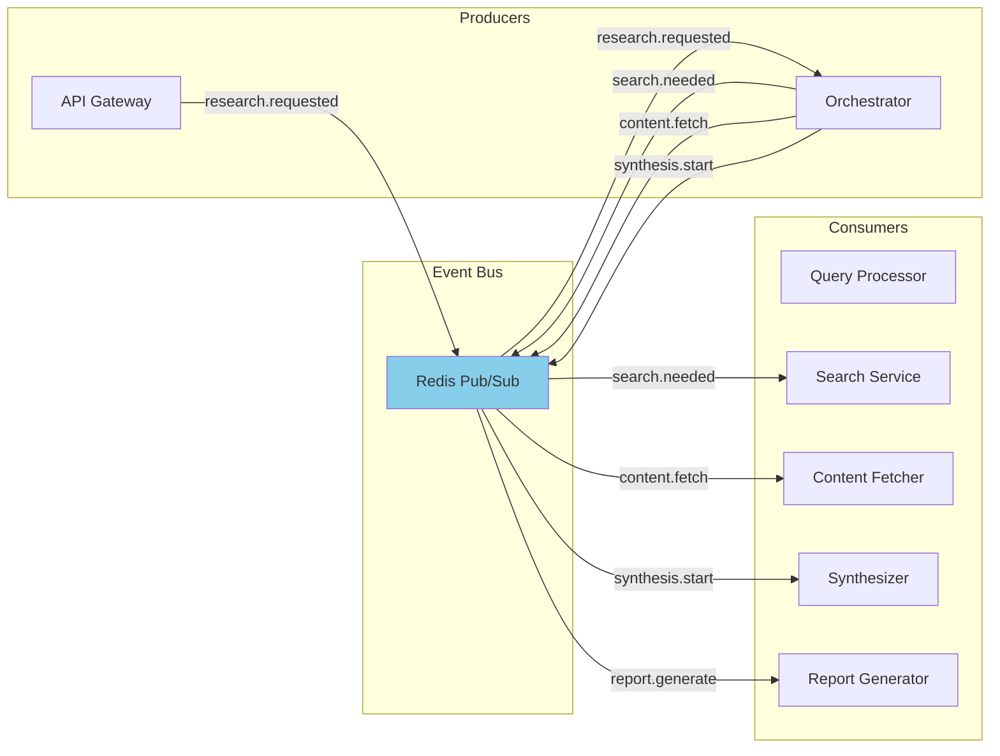

## Component Architecture

### Research Orchestrator Flow

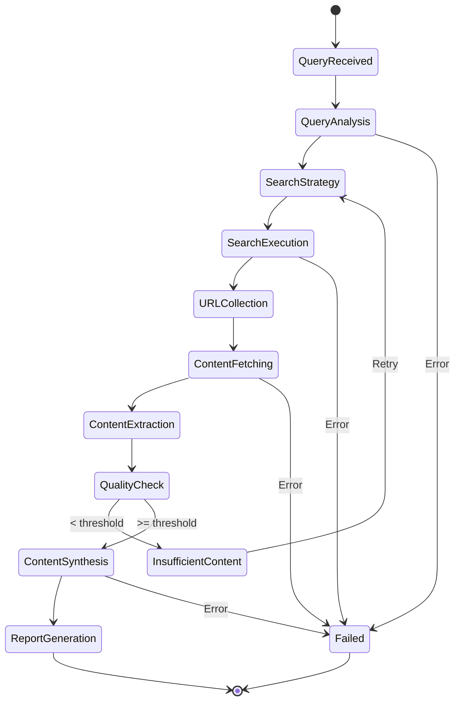

### Data Flow Architecture

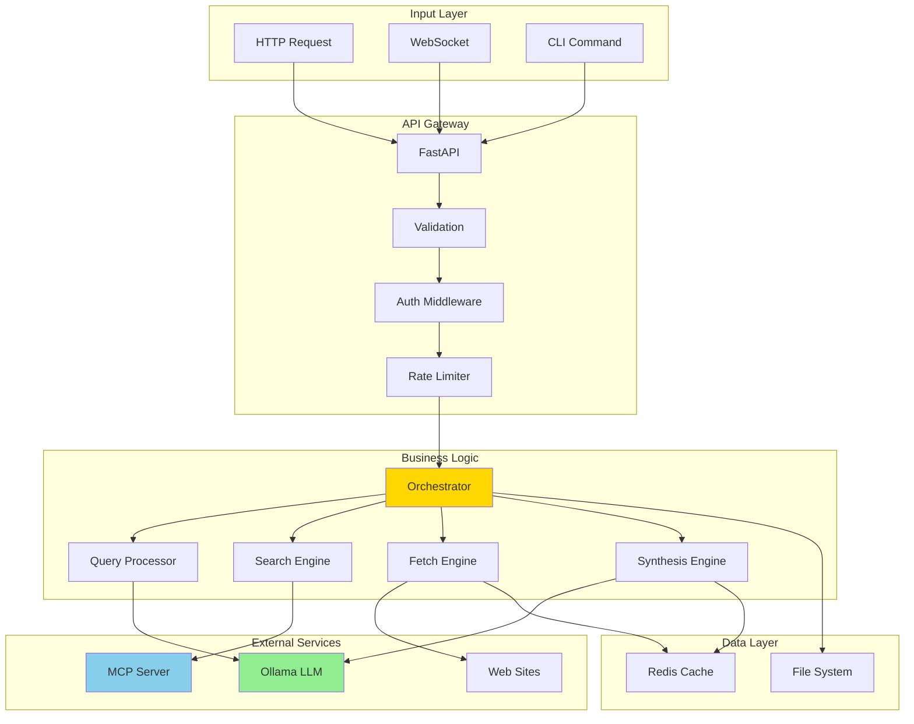

## Sequence Diagrams

### Complete Research Flow

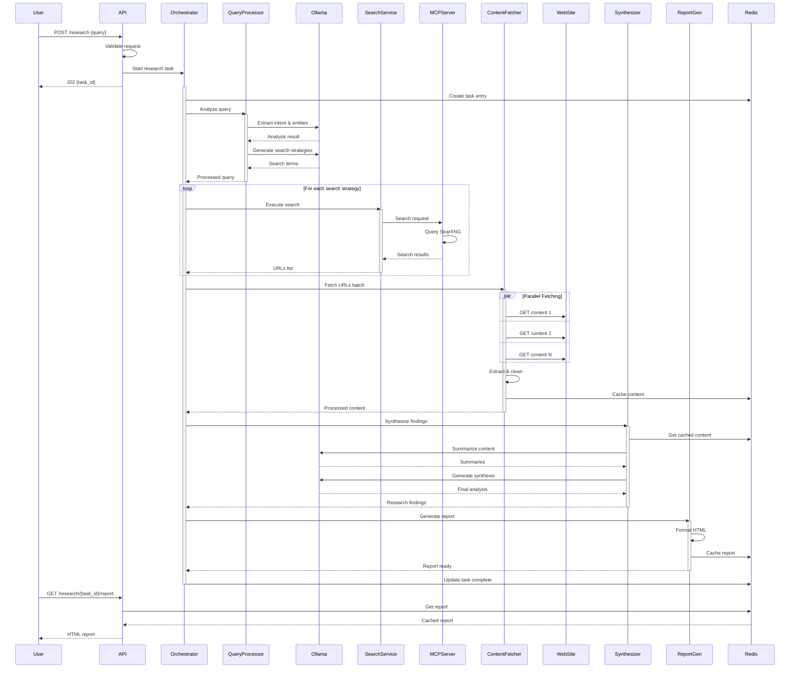

### Real-time Streaming Flow

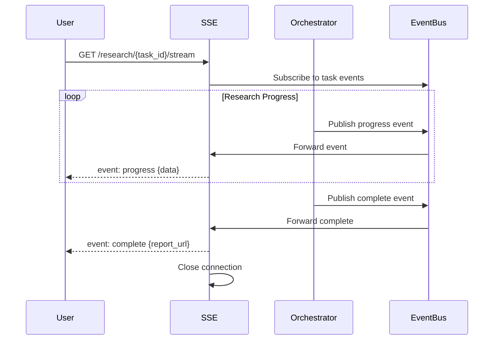

## Deployment Architecture

### Container Architecture

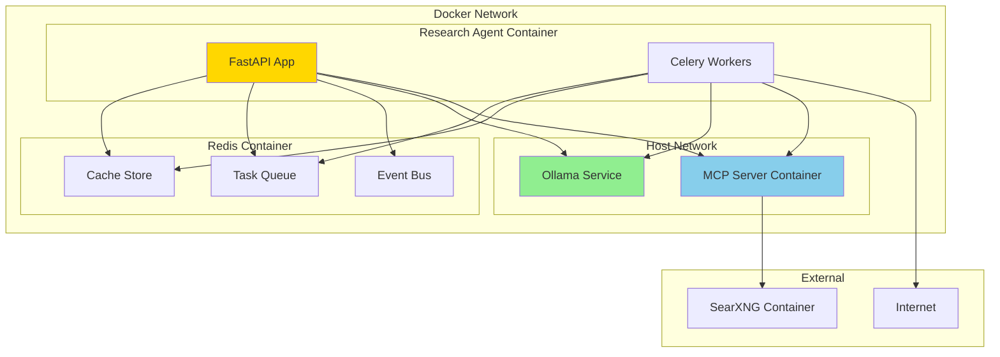

### Kubernetes Architecture (Future)

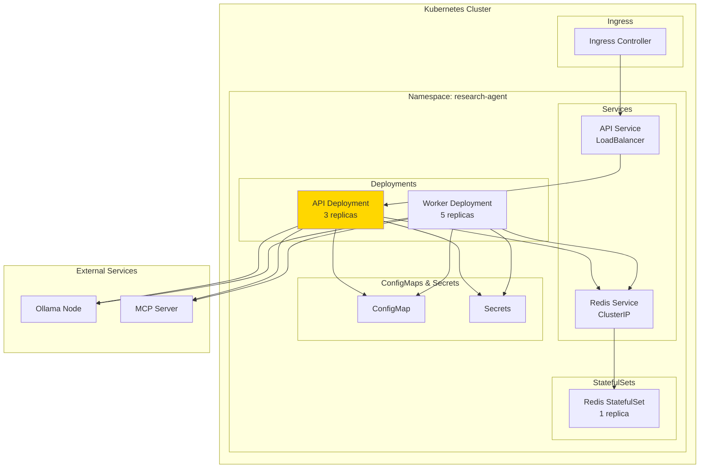

## Scalability Architecture

### Horizontal Scaling Pattern

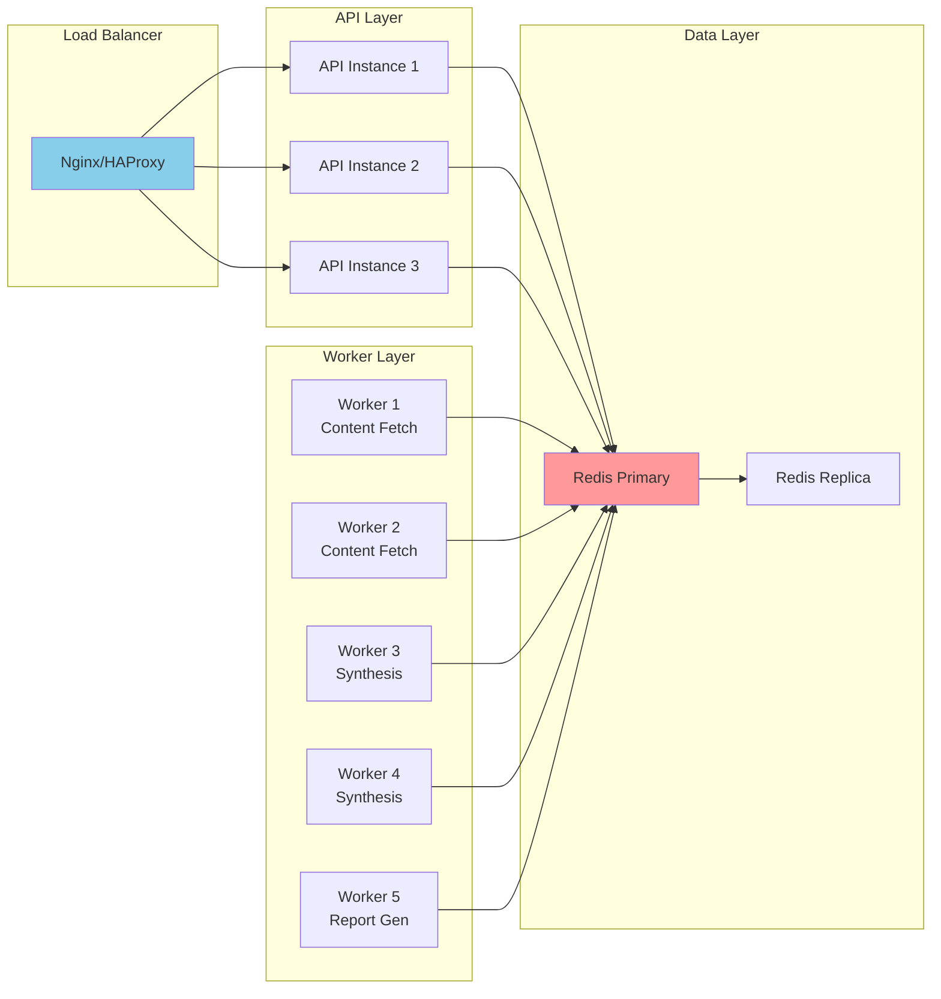

## Security Architecture

### Security Layers

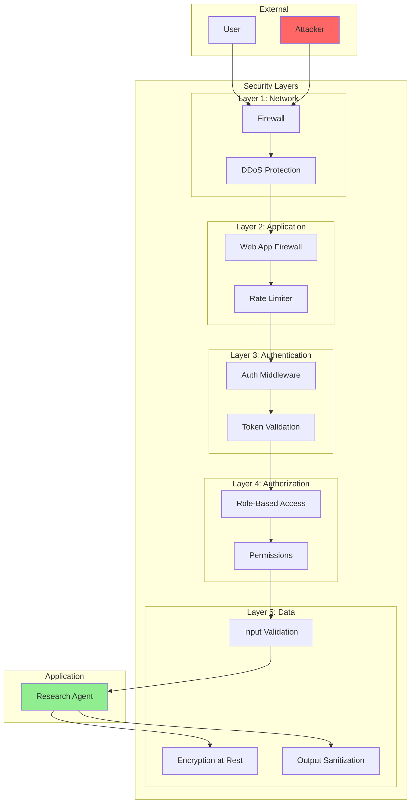

## Caching Architecture

### Multi-Level Cache Strategy

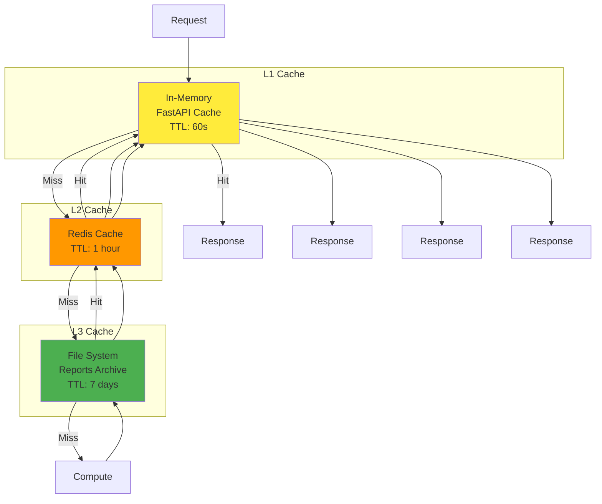

## Error Handling Architecture

### Circuit Breaker Pattern

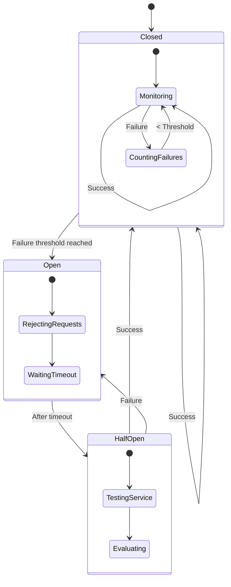

## Monitoring Architecture

### Observability Stack

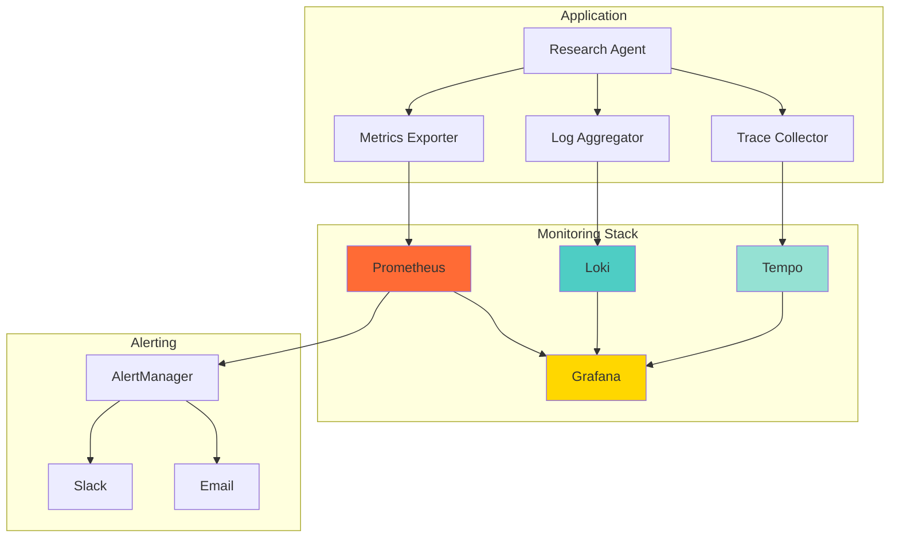

## Performance Optimization Patterns

### Async Processing Pipeline

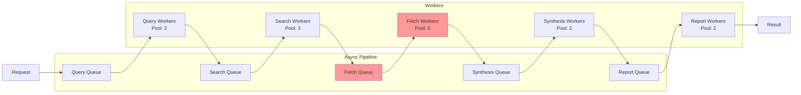

## Database Schema (Redis)

### Key Structure

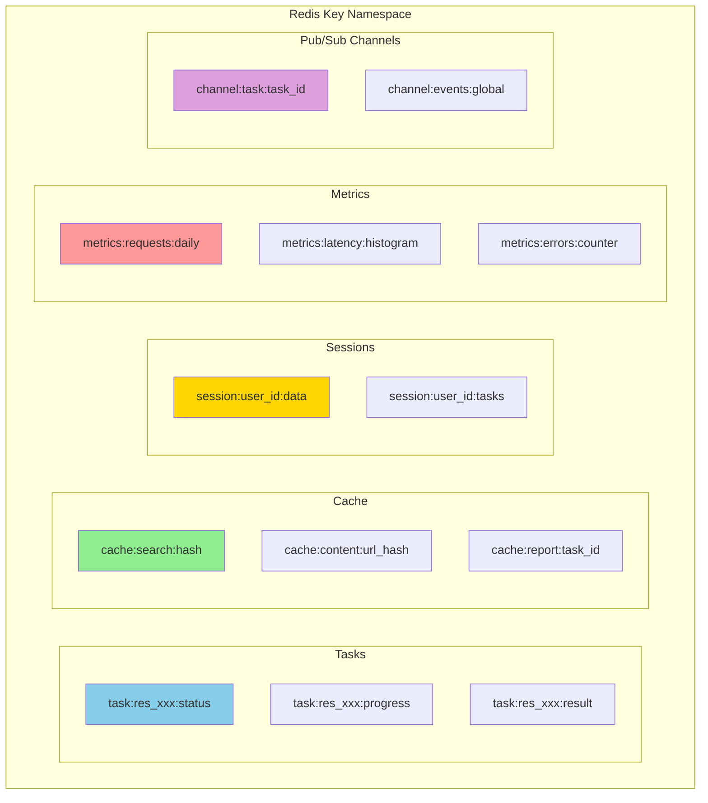

## Technology Decisions

### Technology Stack Rationale

| Component | Technology | Rationale |
|-----------|------------|-----------|
| **Language** | Python 3.11+ | Async support, rich ecosystem, LLM libraries |
| **Framework** | FastAPI | High performance, automatic OpenAPI docs, async native |
| **LLM Client** | Ollama Python | Local processing, privacy, no API costs |
| **Task Queue** | Celery + Redis | Mature, scalable, monitoring tools |
| **Cache** | Redis | Fast, pub/sub support, persistence options |
| **Content Extraction** | Trafilatura + BeautifulSoup | Best accuracy, fallback options |
| **PDF Processing** | PyPDF2 | Pure Python, no system dependencies |
| **HTML Reports** | Jinja2 | Fast, secure, familiar syntax |
| **Monitoring** | Prometheus + Grafana | Industry standard, rich dashboards |
| **Container** | Docker | Consistent deployment, easy scaling |

## Architectural Principles

1. **Separation of Concerns**: Each component has a single, well-defined responsibility
2. **Async-First**: All I/O operations are asynchronous for maximum concurrency
3. **Fail-Fast**: Quick failure detection and graceful degradation
4. **Cache Everything**: Multi-level caching for performance
5. **Observability**: Comprehensive logging, metrics, and tracing
6. **Security by Design**: Defense in depth, input validation, output sanitization
7. **Scalability**: Horizontal scaling through stateless components
8. **Modularity**: Loosely coupled components with clear interfaces

## Future Architecture Considerations

### Planned Enhancements

1. **GraphQL API**: Alternative to REST for flexible querying
2. **gRPC Services**: Internal service communication
3. **Event Sourcing**: Complete audit trail of research tasks
4. **CQRS Pattern**: Separate read/write models for optimization
5. **Federated Search**: Distributed search across multiple instances
6. **ML Pipeline**: Custom model training for domain-specific research
7. **Knowledge Graph**: Persistent knowledge base from research
8. **Multi-tenancy**: Isolated environments for different users/organizations