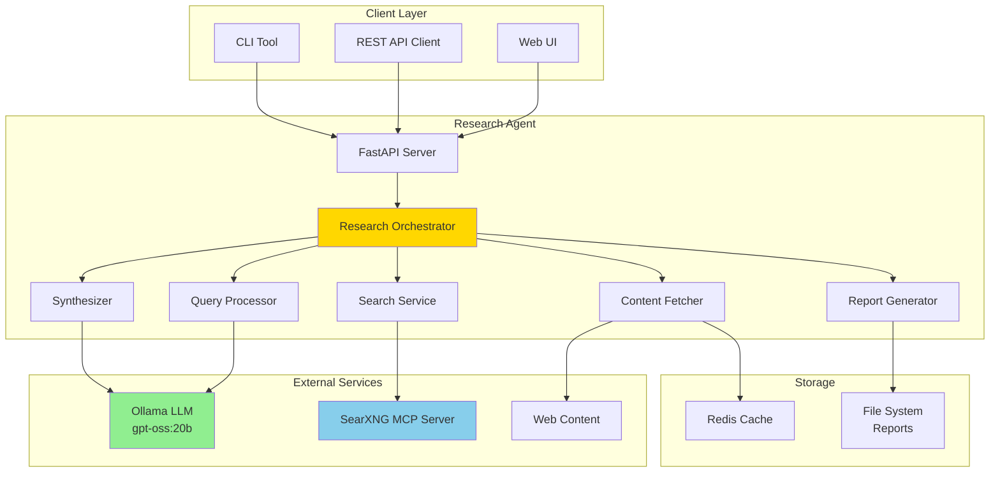
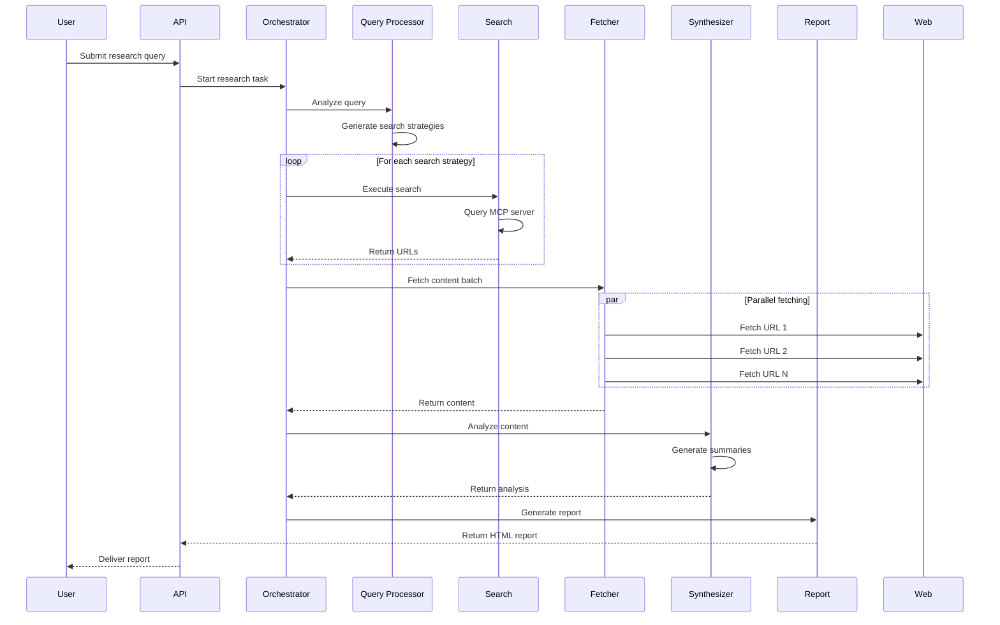

# Research Agent Microservice - System Design Document

## Executive Summary

The Research Agent is an intelligent microservice that automates comprehensive research tasks by combining local LLM processing (Ollama), privacy-respecting web search (SearXNG MCP), and intelligent content extraction to produce detailed HTML reports with citations.

## System Overview

### Purpose
Create an autonomous research assistant that:
- Accepts natural language research queries
- Performs intelligent, multi-step web searches
- Fetches and analyzes full content from sources
- Synthesizes findings into comprehensive reports
- Maintains privacy through local processing

### Key Features
- **Intelligent Query Processing**: LLM-powered query understanding and expansion
- **Multi-Source Research**: Parallel content fetching from diverse sources
- **Content Extraction**: Smart extraction from HTML, PDF, and other formats
- **Synthesis & Summarization**: AI-powered analysis and summary generation
- **Professional Reports**: HTML reports with citations, summaries, and insights
- **Privacy-First**: All processing done locally, no external API dependencies

## Architecture

### High-Level Architecture



### Component Architecture

#### 1. Research Orchestrator
**Purpose**: Central coordinator for the research workflow

**Responsibilities**:
- Workflow management
- State tracking
- Error handling and recovery
- Progress reporting

**Key Methods**:
```python
class ResearchOrchestrator:
    async def execute_research(query: str) -> ResearchReport
    async def track_progress(task_id: str) -> Progress
    async def cancel_research(task_id: str) -> bool
```

#### 2. Query Processor
**Purpose**: Analyze and expand user queries using LLM

**Features**:
- Intent recognition
- Query expansion
- Search term generation
- Follow-up question identification

**Processing Pipeline**:
```
User Query → Intent Analysis → Entity Extraction →
Search Strategy → Multiple Search Queries
```

#### 3. Search Service
**Purpose**: Interface with SearXNG MCP server for web searches

**Capabilities**:
- Parallel search execution
- Result deduplication
- Relevance scoring
- Pagination handling

#### 4. Content Fetcher
**Purpose**: Extract and process content from URLs

**Supported Formats**:
- HTML articles (news, blogs, documentation)
- PDF documents
- GitHub repositories
- Academic papers
- Video transcripts (YouTube)

**Extraction Strategy**:
```python
class ContentFetcher:
    async def fetch_batch(urls: List[str]) -> List[Content]
    async def extract_article(html: str) -> Article
    async def extract_pdf(pdf_url: str) -> Document
    async def handle_github(repo_url: str) -> Repository
```

#### 5. Synthesizer
**Purpose**: Analyze and summarize collected content

**Processing Levels**:
1. **Document-level**: Summarize individual sources
2. **Topic-level**: Group related information
3. **Report-level**: Create comprehensive synthesis

#### 6. Report Generator
**Purpose**: Create professional HTML reports

**Report Components**:
- Executive summary
- Key findings
- Detailed analysis
- Source citations
- Related topics
- Visual elements (charts, timelines)

## Data Flow

### Research Workflow



## Technology Stack

### Core Technologies
- **Language**: Python 3.11+
- **Framework**: FastAPI (async REST API)
- **LLM Integration**: Ollama Python client
- **Task Queue**: Celery with Redis backend
- **Caching**: Redis
- **Content Extraction**:
  - BeautifulSoup4 (HTML parsing)
  - Trafilatura (article extraction)
  - PyPDF2 (PDF processing)
  - Playwright (JavaScript-heavy sites)

### Dependencies
```python
# Core
fastapi>=0.109.0
uvicorn>=0.27.0
pydantic>=2.5.0

# LLM & Search
ollama>=0.1.7
httpx>=0.26.0
aiohttp>=3.9.0

# Content Processing
beautifulsoup4>=4.12.0
trafilatura>=1.6.0
pypdf2>=3.0.0
markdown>=3.5.0
playwright>=1.40.0

# Reports
jinja2>=3.1.0
weasyprint>=60.0  # PDF generation

# Infrastructure
redis>=5.0.0
celery>=5.3.0
prometheus-client>=0.19.0

# Development
pytest>=7.4.0
pytest-asyncio>=0.21.0
black>=23.0.0
```

## API Design

### Endpoints

#### Start Research
```http
POST /api/v1/research
Content-Type: application/json

{
  "query": "Latest developments in quantum computing",
  "options": {
    "depth": "comprehensive",  // quick, standard, comprehensive
    "max_sources": 20,
    "languages": ["en"],
    "time_range": "month"
  }
}

Response:
{
  "task_id": "res_123abc",
  "status": "processing",
  "estimated_time": 120
}
```

#### Get Status
```http
GET /api/v1/research/{task_id}/status

Response:
{
  "task_id": "res_123abc",
  "status": "processing",
  "progress": {
    "current_step": "fetching_content",
    "completed_steps": ["query_analysis", "search"],
    "percentage": 45
  }
}
```

#### Get Report
```http
GET /api/v1/research/{task_id}/report

Response:
HTML content or
{
  "format": "json",
  "summary": "...",
  "findings": [...],
  "sources": [...]
}
```

#### Stream Updates (SSE)
```http
GET /api/v1/research/{task_id}/stream

Response: Server-Sent Events
data: {"step": "searching", "message": "Executing search strategy 1/3"}
data: {"step": "fetching", "message": "Fetching content from 15 sources"}
```

## Configuration

### Environment Variables
```yaml
# Ollama Configuration
OLLAMA_BASE_URL: "http://host.docker.internal:11434"
OLLAMA_MODEL: "gpt-oss:20b"
OLLAMA_TIMEOUT: 120
OLLAMA_CONTEXT_LENGTH: 8192

# MCP Server
MCP_SERVER_URL: "http://localhost:8090"
MCP_TIMEOUT: 30

# Content Fetching
MAX_CONCURRENT_FETCHES: 5
FETCH_TIMEOUT: 10
MAX_CONTENT_SIZE: 1048576  # 1MB
USER_AGENT: "ResearchAgent/1.0"

# Redis
REDIS_URL: "redis://localhost:6379"
CACHE_TTL: 3600  # 1 hour

# API Settings
API_HOST: "0.0.0.0"
API_PORT: 8080
API_WORKERS: 4
```

## Security Considerations

### Input Validation
- Sanitize all user inputs
- Query length limits (max 500 characters)
- Rate limiting per IP/user
- XSS prevention in reports

### Content Security
- URL validation and blocklist
- Content size limits
- Timeout protections
- Sandboxed content extraction

### Privacy
- No external API calls (except web fetching)
- Local LLM processing
- No user data persistence
- Optional request logging

## Performance Optimization

### Caching Strategy
```python
# Three-tier caching
1. Query Cache: Cache search results (1 hour)
2. Content Cache: Cache fetched content (24 hours)
3. Report Cache: Cache generated reports (7 days)
```

### Concurrency
- Async/await throughout
- Connection pooling for HTTP clients
- Parallel content fetching with semaphore limits
- Background task processing with Celery

### Resource Management
- Memory limits for content processing
- CPU throttling for LLM requests
- Disk space management for reports
- Connection limits for external services

## Monitoring & Observability

### Metrics (Prometheus)
- Request count and latency
- Search success rate
- Content fetch success rate
- LLM response times
- Cache hit rates

### Logging
```python
# Structured logging
{
  "timestamp": "2025-09-17T10:30:00Z",
  "level": "INFO",
  "service": "research-agent",
  "component": "content_fetcher",
  "task_id": "res_123abc",
  "message": "Fetched content",
  "url": "https://example.com",
  "duration_ms": 234
}
```

### Health Checks
```http
GET /health
GET /ready
GET /metrics
```

## Error Handling

### Retry Strategy
```python
class RetryConfig:
    max_attempts = 3
    backoff_factor = 2
    max_backoff = 30

    retry_on = [
        ConnectionError,
        TimeoutError,
        HTTPError(status_code=429)  # Rate limited
    ]
```

### Graceful Degradation
- Partial results on timeout
- Fallback to cached content
- Skip failed sources
- Reduced quality mode

## Deployment

### Docker Deployment
```dockerfile
FROM python:3.11-slim

WORKDIR /app
COPY requirements.txt .
RUN pip install --no-cache-dir -r requirements.txt

COPY . .
EXPOSE 8080

CMD ["uvicorn", "src.main:app", "--host", "0.0.0.0", "--port", "8080"]
```

### Docker Compose
```yaml
version: '3.8'

services:
  research-agent:
    build: .
    ports:
      - "8080:8080"
    environment:
      - OLLAMA_BASE_URL=http://host.docker.internal:11434
    depends_on:
      - redis

  redis:
    image: redis:7-alpine
    ports:
      - "6379:6379"
    volumes:
      - redis_data:/data

volumes:
  redis_data:
```

## Future Enhancements

### Phase 2 Features
- Multi-language support
- Academic paper focus mode
- Real-time collaboration
- Scheduled research tasks
- Research history and versioning

### Phase 3 Features
- Fine-tuned domain models
- Knowledge graph construction
- Automatic fact-checking
- Research workflow templates
- API for third-party integrations

## Success Metrics

### Performance KPIs
- Average research completion time < 2 minutes
- Content fetch success rate > 90%
- Report generation time < 5 seconds
- System uptime > 99.9%

### Quality KPIs
- Source relevance score > 0.8
- Summary accuracy (human evaluated)
- Citation completeness 100%
- User satisfaction > 4.5/5

## Conclusion

The Research Agent microservice provides a powerful, privacy-respecting research automation tool that leverages local LLM processing and comprehensive web content extraction to deliver professional research reports. The modular architecture ensures scalability, maintainability, and extensibility for future enhancements.