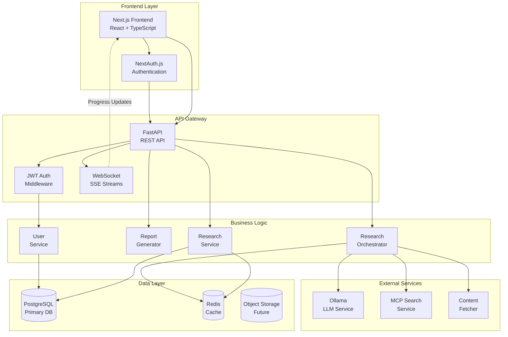
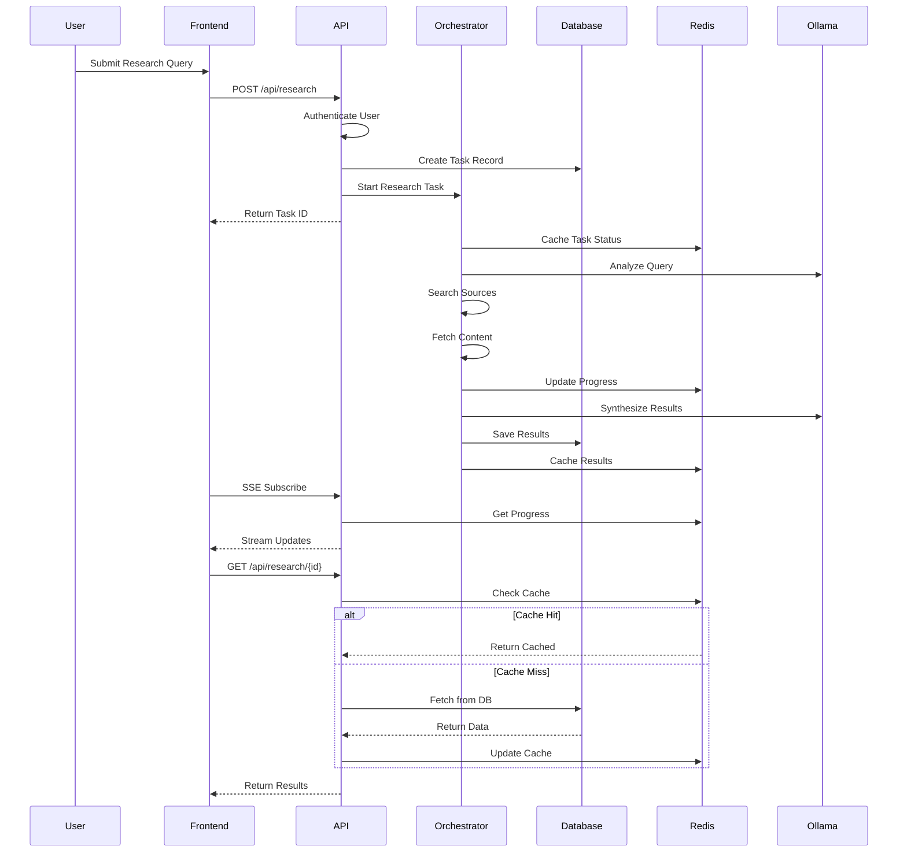
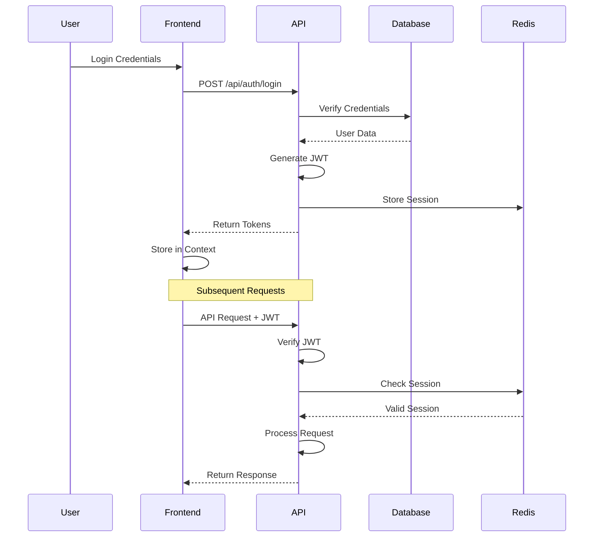
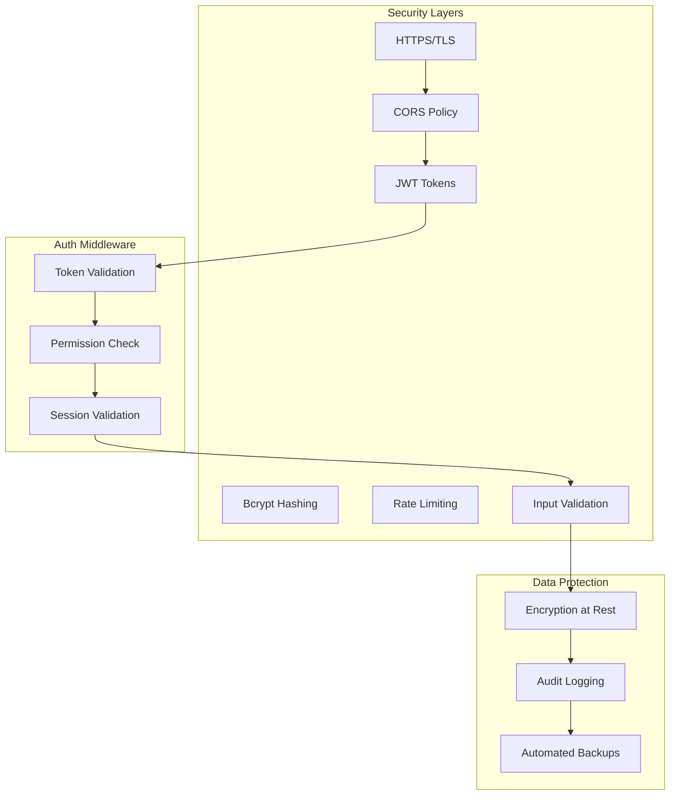
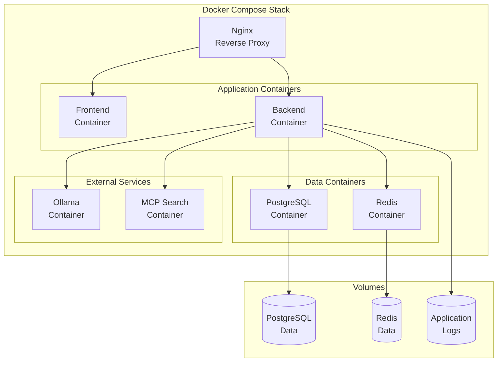

# Research Agent Architecture Overview

## System Architecture



## Component Architecture

```mermaid
graph LR
    subgraph "Frontend Components"
        APP[App Shell]
        AUTH_COMP[Auth Components]
        RESEARCH_COMP[Research UI]
        DASHBOARD[Dashboard]
        HISTORY[History View]
        SHARE[Share Modal]
    end

    subgraph "API Endpoints"
        AUTH_EP[/api/auth/*]
        RESEARCH_EP[/api/research/*]
        USER_EP[/api/user/*]
        SHARE_EP[/api/share/*]
    end

    subgraph "Services"
        AUTH_SVC[AuthService]
        DB_SVC[DatabaseService]
        CACHE_SVC[CacheService]
        SEARCH_SVC[SearchService]
    end

    APP --> AUTH_COMP
    APP --> DASHBOARD
    DASHBOARD --> RESEARCH_COMP
    DASHBOARD --> HISTORY

    AUTH_COMP --> AUTH_EP
    RESEARCH_COMP --> RESEARCH_EP
    HISTORY --> RESEARCH_EP
    SHARE --> SHARE_EP

    AUTH_EP --> AUTH_SVC
    RESEARCH_EP --> DB_SVC
    RESEARCH_EP --> CACHE_SVC
    USER_EP --> DB_SVC
    SHARE_EP --> DB_SVC
```

## Data Flow



## Authentication Flow



## Security Architecture



## Deployment Architecture



## API Structure

### Authentication Endpoints
- `POST /api/auth/register` - User registration
- `POST /api/auth/login` - User login
- `POST /api/auth/logout` - User logout
- `POST /api/auth/refresh` - Refresh token
- `GET /api/auth/verify` - Verify email

### Research Endpoints
- `POST /api/research` - Start new research
- `GET /api/research/{id}` - Get research result
- `GET /api/research/history` - List user's research
- `PUT /api/research/{id}` - Update research metadata
- `DELETE /api/research/{id}` - Delete research
- `GET /api/research/{id}/stream` - SSE progress stream

### User Management
- `GET /api/user/profile` - Get user profile
- `PUT /api/user/profile` - Update profile
- `GET /api/user/settings` - Get user settings
- `PUT /api/user/settings` - Update settings
- `DELETE /api/user` - Delete account

### Sharing & Collaboration
- `POST /api/share/{id}` - Create share link
- `GET /api/share/{token}` - Access shared research
- `DELETE /api/share/{id}` - Revoke share
- `GET /api/share/list` - List shared items

## Performance Optimizations

1. **Caching Strategy**
   - Redis for hot data (active tasks, recent results)
   - PostgreSQL JSONB indexes for fast queries
   - Frontend React Query caching

2. **Database Optimization**
   - Connection pooling
   - Prepared statements
   - Batch inserts for artifacts
   - Pagination for large result sets

3. **Async Processing**
   - Background task queue for heavy operations
   - WebSocket/SSE for real-time updates
   - Concurrent source fetching

4. **Resource Management**
   - Rate limiting per user
   - Request timeout controls
   - Memory usage monitoring
   - Automatic cleanup of old data