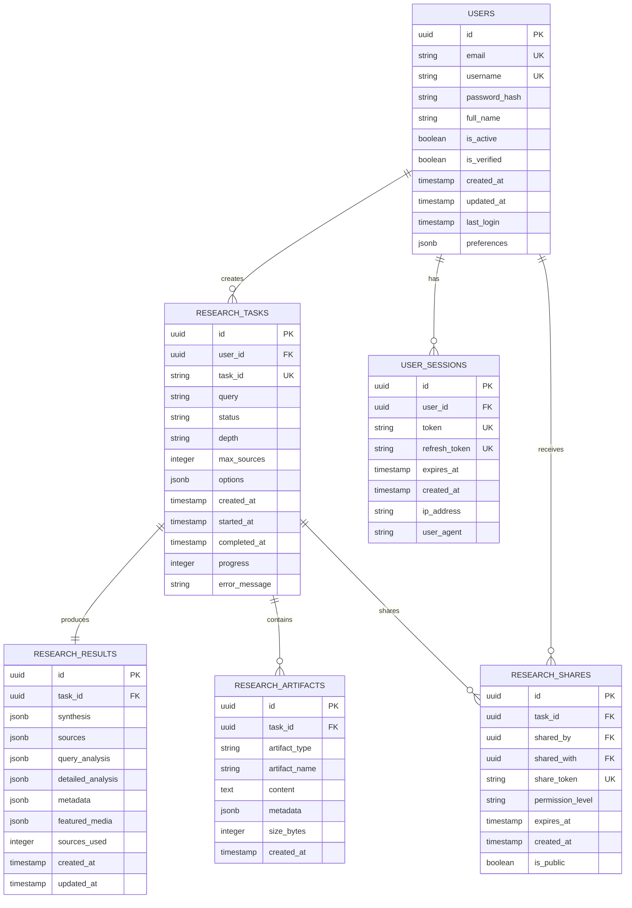

# Research Agent Database Design

## Overview
This document outlines the database architecture for persisting research data and implementing user management in the Research Agent system.

## Database Schema

### Entity Relationship Diagram



## Table Definitions

### users
Primary table for user account management.

| Column | Type | Constraints | Description |
|--------|------|-------------|-------------|
| id | UUID | PRIMARY KEY | Unique user identifier |
| email | VARCHAR(255) | UNIQUE, NOT NULL | User email address |
| username | VARCHAR(100) | UNIQUE, NOT NULL | Display username |
| password_hash | VARCHAR(255) | NOT NULL | Bcrypt hashed password |
| full_name | VARCHAR(255) | | User's full name |
| is_active | BOOLEAN | DEFAULT true | Account active status |
| is_verified | BOOLEAN | DEFAULT false | Email verification status |
| created_at | TIMESTAMP | DEFAULT NOW() | Account creation time |
| updated_at | TIMESTAMP | | Last profile update |
| last_login | TIMESTAMP | | Last successful login |
| preferences | JSONB | DEFAULT '{}' | User preferences |

### user_sessions
JWT session tracking for security and analytics.

| Column | Type | Constraints | Description |
|--------|------|-------------|-------------|
| id | UUID | PRIMARY KEY | Session identifier |
| user_id | UUID | FOREIGN KEY | Reference to users.id |
| token | VARCHAR(500) | UNIQUE | JWT access token |
| refresh_token | VARCHAR(500) | UNIQUE | JWT refresh token |
| expires_at | TIMESTAMP | NOT NULL | Token expiration |
| created_at | TIMESTAMP | DEFAULT NOW() | Session start |
| ip_address | INET | | Client IP |
| user_agent | TEXT | | Browser/client info |

### research_tasks
Core research task tracking table.

| Column | Type | Constraints | Description |
|--------|------|-------------|-------------|
| id | UUID | PRIMARY KEY | Internal identifier |
| user_id | UUID | FOREIGN KEY | Task owner |
| task_id | VARCHAR(50) | UNIQUE | External task ID |
| query | TEXT | NOT NULL | Research query |
| status | VARCHAR(20) | NOT NULL | Task status |
| depth | VARCHAR(20) | DEFAULT 'standard' | Research depth |
| max_sources | INTEGER | DEFAULT 20 | Source limit |
| options | JSONB | | Additional options |
| created_at | TIMESTAMP | DEFAULT NOW() | Task creation |
| started_at | TIMESTAMP | | Processing start |
| completed_at | TIMESTAMP | | Task completion |
| progress | INTEGER | DEFAULT 0 | Progress percentage |
| error_message | TEXT | | Error details if failed |

### research_results
Complete research results storage.

| Column | Type | Constraints | Description |
|--------|------|-------------|-------------|
| id | UUID | PRIMARY KEY | Result identifier |
| task_id | UUID | FOREIGN KEY, UNIQUE | Reference to task |
| synthesis | JSONB | NOT NULL | Synthesis data |
| sources | JSONB | NOT NULL | Source documents |
| query_analysis | JSONB | | Query analysis |
| detailed_analysis | JSONB | | Detailed sections |
| metadata | JSONB | | Additional metadata |
| featured_media | JSONB | | Media recommendations |
| sources_used | INTEGER | | Number of sources |
| created_at | TIMESTAMP | DEFAULT NOW() | Result creation |
| updated_at | TIMESTAMP | | Last modification |

### research_artifacts
Storage for individual research artifacts (summaries, extracts, etc).

| Column | Type | Constraints | Description |
|--------|------|-------------|-------------|
| id | UUID | PRIMARY KEY | Artifact identifier |
| task_id | UUID | FOREIGN KEY | Parent task |
| artifact_type | VARCHAR(50) | NOT NULL | Type of artifact |
| artifact_name | VARCHAR(255) | | Artifact name |
| content | TEXT | | Artifact content |
| metadata | JSONB | | Additional metadata |
| size_bytes | INTEGER | | Content size |
| created_at | TIMESTAMP | DEFAULT NOW() | Creation time |

### research_shares
Sharing and collaboration features.

| Column | Type | Constraints | Description |
|--------|------|-------------|-------------|
| id | UUID | PRIMARY KEY | Share identifier |
| task_id | UUID | FOREIGN KEY | Shared research |
| shared_by | UUID | FOREIGN KEY | Sharing user |
| shared_with | UUID | FOREIGN KEY | Recipient user |
| share_token | VARCHAR(100) | UNIQUE | Public share token |
| permission_level | VARCHAR(20) | DEFAULT 'read' | Access level |
| expires_at | TIMESTAMP | | Share expiration |
| created_at | TIMESTAMP | DEFAULT NOW() | Share creation |
| is_public | BOOLEAN | DEFAULT false | Public accessibility |

## Indexes

```sql
-- Performance indexes
CREATE INDEX idx_research_tasks_user_id ON research_tasks(user_id);
CREATE INDEX idx_research_tasks_status ON research_tasks(status);
CREATE INDEX idx_research_tasks_created_at ON research_tasks(created_at DESC);
CREATE INDEX idx_research_results_task_id ON research_results(task_id);
CREATE INDEX idx_research_artifacts_task_id ON research_artifacts(task_id);
CREATE INDEX idx_research_artifacts_type ON research_artifacts(artifact_type);
CREATE INDEX idx_user_sessions_user_id ON user_sessions(user_id);
CREATE INDEX idx_user_sessions_expires_at ON user_sessions(expires_at);
CREATE INDEX idx_research_shares_task_id ON research_shares(task_id);
CREATE INDEX idx_research_shares_token ON research_shares(share_token);

-- Full-text search indexes
CREATE INDEX idx_research_tasks_query_gin ON research_tasks USING gin(to_tsvector('english', query));
CREATE INDEX idx_research_results_synthesis_gin ON research_results USING gin(synthesis);
```

## Data Types

### Artifact Types
- `summary` - Content summaries
- `extract` - Extracted content
- `analysis` - Analysis sections
- `quote` - Notable quotes
- `statistic` - Key statistics
- `media` - Media references

### Status Values
- `pending` - Queued for processing
- `analyzing` - Query analysis
- `searching` - Searching sources
- `fetching` - Fetching content
- `synthesizing` - Generating synthesis
- `generating` - Creating report
- `completed` - Successfully completed
- `failed` - Task failed
- `cancelled` - User cancelled

### Permission Levels
- `read` - View only
- `comment` - Add comments
- `edit` - Modify content
- `admin` - Full control

## Migration Strategy

1. Existing in-memory tasks will be migrated to database on first run
2. Redis will continue to be used for caching with database as source of truth
3. Background job will persist active tasks every 30 seconds
4. Completed tasks immediately written to database